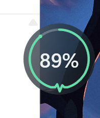
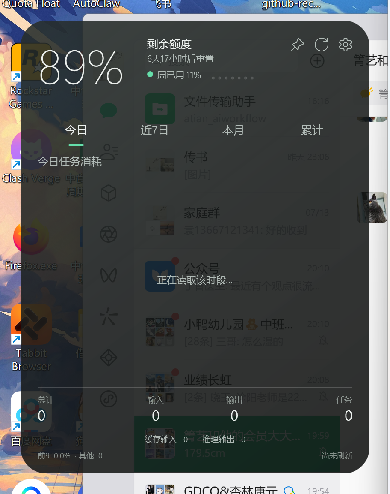
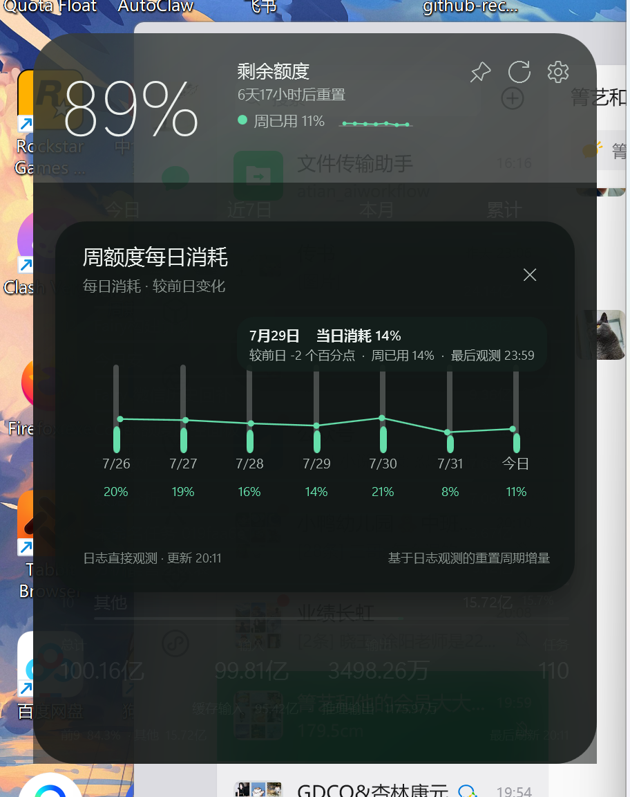

**[中文](README.md) | English**

# Codex Usage Widget

A local-only Windows 11 desktop widget for monitoring remaining Codex quota
and per-task token usage. It is built with WPF, .NET 8, SQLite, and MVVM, and
is published as a self-contained, single-file Windows x64 executable. Users do
not need to install .NET.

> This is an unofficial community project. It is not affiliated with,
> sponsored by, or endorsed by OpenAI.

## Download

Download `CodexUsageWidget.exe` from
[GitHub Releases](../../releases/latest). It is a self-contained Windows x64
single file and does not require a separate .NET installation. The current
binary is not code-signed, so Windows SmartScreen may warn on first launch;
verify the SHA-256 published on the Release page before running it.

`dist\CodexUsageWidget.exe` is a local build output and is intentionally not
stored in Git history.
See the [changelog](CHANGELOG.md) for version history.

## Interface

Choose a 32×32 glow, an 80×80 circle, or a 208×80 capsule under
**Appearance → Idle style**. Glow omits the number and communicates remaining
quota through a static halo and status color. Circle and capsule retain the
remaining percentage and lightweight status information.
Hovering expands the selected style directly into a 420×540 detail panel,
with no short-lived intermediate state. The panel can be pinned, or it
collapses immediately back to the selected style when the pointer leaves.
New installations default to the circle.

The collapsed indicator is the fixed position anchor. The panel expands to the
right when space is available and to the left otherwise; it expands upward
when there is not enough room below. Collapsing always returns the indicator
to exactly the same anchor position.

The heartbeat-shaped segment at the bottom of the circular indicator is part
of the progress track, not a separate decoration. It lights only after the
progress reaches that segment.

The capsule status and waveform color follow the remaining quota: 70% and
above is “Plenty left,” 30%–69% is “Usage stable,” 10%–29% is “Quota low,”
1%–9% is “Almost empty,” and 0% is “Empty.” Initial loading can also show
“Syncing” or “Waiting.” Glow, circle, and capsule share the same policy, which is
recomputed only on existing quota events and adds no polling. Capsule numbers,
labels, and status colors use dedicated high-contrast light/dark palettes. The
capsule does not use the shadow effect that can produce a rectangular clipped
surface, and its desktop snapshot is independently clipped to the rounded
shape so pixels outside the capsule remain fully transparent.

| Glow | Default circle | Optional capsule | Expanded panel |
|---|---|---|---|
|  |  |  |  |

These public screenshots come from one validated EXE batch.
`capture-ui.ps1` generates the default circle and expanded panel, while
`audit-idle-styles.ps1` generates Glow and Capsule. Window dimensions, interaction
results, and the tested EXE hash are recorded in
[`ui-audit.json`](docs/screenshots/ui-audit.json) and
[`idle-style-audit.json`](docs/idle-style-audit.json); both reports record the
same SHA-256. This evidence applies only to the EXE recorded in those reports.
Regenerate the corresponding set after publishing a different EXE;
screenshots from different hash batches must not be treated as one final
validation run. The comprehensive UI audit also moves the real pointer onto
a weekly-quota date node and verifies that showing its tooltip does not
terminate the application.

Only one Vision Glass visual style is included. It adapts to
System / Light / Dark theme modes while preserving the same layout,
interaction, and material language. Light and dark modes use separate
secondary-text contrast values, and summary figures retain normal weight for
readability on complex desktop backgrounds.

The glass material does not use native Windows Acrylic. On explicit events
only—load, expand/collapse, theme or DPI changes, the end of a drag, or manual
refresh—the app captures the desktop directly beneath the widget once. It
software-blurs that snapshot on a background thread and uses the frozen image
inside the WPF surface. There is no continuous screen capture, live backdrop
blur, rendering loop, or always-running animation.

Appearance includes a `0%–100%` glass-transparency slider. `0%` is fully
opaque, while `50%` exactly preserves the original glass look and is the
default for new installations. Higher values make the main glass background
more transparent. `100%` exactly matches the previous `99%` safe endpoint:
the app retains a nonzero material and hit-test layer so controls, dragging, and
pointer recognition remain reliable. Text, icons, progress lines, and status
colors remain fully opaque. Transparency changes apply after Save. Settings
does not show a simulated glass sample, avoiding a misleading mismatch with
the user's actual desktop background.

Neither idle nor expanded state draws an extra rectangular base or decorative
frame. The 80×80 circle uses a circular surface; the 208×80 capsule and
420×540 panel use their own rounded surfaces. The rest of the window remains
per-pixel transparent.

The “weekly used” value and seven-day sparkline are global quota status, not
content owned by a token-usage tab. They therefore remain present on Today,
7 Days, Month, and All views. Selecting the status opens the seven-day detail
inside the same 420×540 window rather than creating another window:



The four token periods are:

- **Today**: the current local calendar day.
- **7 Days**: the rolling 168 hours immediately before the current time.
- **Month**: from the first day of the current local month through now.
- **All**: logs still present locally or previously indexed by this widget.

Each period displays at most ten rows. The first nine are real tasks; when
more than nine tasks exist, row ten is a non-expandable **Other** aggregate.
The footer summarizes input, output, cached input, reasoning output, and total
tokens, with `Top 9 + Other = Total`. Sub-agent, approval-agent, and parallel
agent usage is assigned to the corresponding root task.

Token units follow the selected interface language, retain at most two decimal
places, and omit insignificant trailing zeros:

- **Simplified Chinese**: full integers below 10,000, then
  `万 / 亿 / 万亿`; for example `9,876`, `6.03亿`, and `1.01万亿`.
- **English**: full integers below 1,000, then `K / M / B / T`; for example
  `9,876` becomes `9.88K`, and `602,820,000` becomes `602.82M`.

## Usage and settings

Run `dist\CodexUsageWidget.exe`. The app supports on-demand incremental
refresh, always-on-top mode, immediate auto-collapse, Codex Home selection,
persisted window position, and persisted active period. Only one instance can
run at a time.

Theme modes:

- **Follow system (System)**: the default for new installations. Windows
  light/dark changes are received through system events, without polling.
- **Light**
- **Dark**

Language modes:

- **Follow system (System)**: any Windows UI culture in the `zh-*` family uses
  Simplified Chinese; all other cultures use English.
- **简体中文**
- **English**

Settings are ordered by usage frequency:
**Appearance → Resident behavior → Data source → Maintenance**. Theme,
language, idle style, and glass transparency are all in the first Appearance
group. Idle styles:

- **Glow**: 32×32, number-free quota halo with the smallest desktop footprint.
- **Circle**: 80×80, the default option with a percentage readout.
- **Capsule**: 208×80, with a short persistent status beside the percentage.

Switching idle style adds no polling, log reads, or SQLite queries. All styles
use the same event-driven refresh policy while idle.

The default **Pause monitoring while the display is off** setting is also
event-driven: display-off, session-lock, and system-suspend notifications pause
file watchers, quota-tail reads, and page queries at safe cancellation points.
After the display is on and the session is unlocked, monitoring is rebuilt and
the latest quota is calibrated once. Full statistics remain user-triggered, and
Codex continues writing its own logs while the widget is dormant, so no source
data is deleted or intercepted.

Saving a language change updates the main window, settings, system tray,
tooltips, date formats, and token units in the current process; no restart is
required. A language change only swaps small in-memory string resources. It
does not scan logs, refresh statistics, query SQLite, or rebuild the file
watcher, so its steady-state resource cost is negligible. Task titles come
from local Codex logs and are preserved as-is rather than machine-translated.

The System / Light / Dark variants and global weekly-quota overlay are
validated together by `capture-themes.ps1`. The current
[`theme-audit.json`](docs/screenshots/theme-audit.json) records PASS for all
three modes, seven weekly-quota date elements in each mode, and an unchanged
top-level HWND count of `1 → 1` while opening the overlay. The
[dark](docs/screenshots/theme-dark.png),
[light](docs/screenshots/theme-light.png), and
[system](docs/screenshots/theme-system.png) screenshots and their overlay
counterparts are generated by that run. Its report includes the tested EXE
hash, and its conclusions apply only to that hash. It must be regenerated after
a new build.

The settings window has a logical size of 460×590. Older settings remain
compatible; the obsolete collapse-delay input is no longer shown.

The system tray menu provides:

- Show / hide
- Refresh now
- Settings
- Start with Windows
- Exit

The tray and EXE icons use an original transparent six-lobe interlocking
hollow-line mark with stronger small-size contrast rather than a filled disc.
Tray strokes switch between dark and light with the system theme, while a
separate top-right status dot changes between green, yellow, orange, and red.
The EXE embeds dedicated sizes from 16 through 256 pixels to keep the mark crisp
at notification-area scale. The mark is original and does not reproduce a
third-party brand logo.

Start with Windows is disabled by default and writes a Windows startup entry
only after the user explicitly enables it.

## Data source and accounting

The app reads only these files under the selected Codex Home:

```text
sessions\**\*.jsonl
archived_sessions\**\*.jsonl
session_index.jsonl
```

- Total tokens = input tokens + output tokens.
- Cached input is already included in input, and reasoning output is already
  included in output; neither is counted twice.
- Each rollout file keeps an independent monotonic high-water mark for all five
  cumulative fields. Only values above the existing high water become usage,
  so slightly older concurrent snapshots cannot create a full-counter spike.
- File growth remains incremental. Truncation, same-length rewrites, and file
  replacement are detected by continuity checks and start a fresh high-water
  checkpoint from the replacement content.
- A child-agent rollout may copy root-task history before its first top-level
  `inter_agent_communication_metadata` record. Those inherited events are
  excluded instead of counted again. The first real turn and all later usage
  remain included, and later communication records do not create new cutoffs.
- A root-level subagent fork without `parent_thread_id` compares its cumulative-
  token sequence with the source task and trims their longest matching prefix.
  Copied trigger markers therefore cannot end deduplication early. If the source
  task has not been indexed yet, the fork waits for a later refresh without
  committing an unverified total.
- Indexes from the older counter algorithm are rebuilt once on the next
  user-requested statistics refresh. An index that already uses high-water
  accounting reads only first-row metadata and reparses affected root-level
  subagent forks.
  Startup and collapsed idle mode do not scan history for this migration. The
  accounting version and checkpoints keep later work incremental.
- The All page is a cumulative total from readable logs in the selected local
  Codex Home. The Codex account Profile may use different server-side coverage
  and refresh timing, so the two views are not guaranteed to match moment by
  moment.
- Remaining percentage comes from the newest local `rate_limits` event. When
  absent, the widget shows `--` instead of guessing a quota from total usage.
- Weekly-quota details read only the exact `limit_id=codex`, 10,080-minute
  window. Each bar and line point represents weekly-quota percentage points
  consumed during that local calendar day—not an end-of-day cumulative snapshot
  and not a value inherited from the previous day.
- Within each observed reset window, daily consumption advances only from a
  monotonic high-water mark. `reset_at` values within 60 seconds are clustered
  into one logical window. Each day follows the timeline from its final valid
  quota observation and reports only that timeline's start-to-end high-water
  increase. This prevents parallel timelines from duplicating usage or assigning
  an entire window total to today. Stale lower concurrent snapshots and reset
  drops do not create negative usage. Daily change compares the two
  daily-consumption values only when both are available.
- Historical observations already present in local logs or the index can be
  viewed immediately. New observations are incrementally indexed only after
  an explicit statistics refresh or opening the weekly-quota detail. A blank
  or partial day means a reliable baseline or sufficient local observations
  were not available.
- Startup performs one latest-quota calibration. The first run builds one
  single-threaded background history index; later runs process only new or
  changed statistical content.
- Collapsed mode has no fixed 30-second poll, periodic ranking query, or
  periodic SQLite write. Log changes trigger quota-only tail reading after
  roughly 1.5 seconds of quiet, or at most once every roughly 3 seconds during
  continuous writes. The UI is not updated when quota is unchanged.
- When display-off, session-lock, or system-suspend events put monitoring to
  sleep, those watchers and reads stop without polling. Display-on plus unlock
  resumes them and performs one bounded latest-quota calibration.
- Hover expansion returns to Today and refreshes only Today. Selecting a
  period—including selecting the current period again—refreshes only that
  period. Manual refresh updates the active period and quota.
- Seven-day weekly-quota history is queried only after selecting its top-level
  entry. Collapse, hover expansion, token-tab changes, and the quota watcher
  do not query it automatically.
- A pinned panel never refreshes statistics by itself. Period selection or
  manual refresh remains required, while quota may still update from log
  events.

## Privacy and local storage

The app does not connect to the network, upload data, or open `auth.json`,
passwords, or access tokens. The parser must sequentially read local JSONL
lines to identify token, quota, and session-metadata events, but it does not
extract, persist, or upload prompt or conversation-body fields. SQLite stores
only the task identifiers, titles, time buckets, token counters, and
incremental-file state needed for statistics.

Errors that cannot be handled safely in the UI are written on a best-effort
basis to `%LocalAppData%\CodexUsageWidget\diagnostics.log`. The local-only log
rotates at 1 MiB; a logging failure never blocks shutdown or recovery.

Settings and indexes are stored under:

```text
%LocalAppData%\CodexUsageWidget
```

Each Codex Home gets a separate database based on a hash of its normalized
path, for example:

```text
usage-index-<home-hash>.db
```

Statistics from different Codex Home directories are therefore never mixed.

## Build and validation

Building requires Windows 10/11, PowerShell 5.1 or later, and the .NET 8 SDK.

Repository scripts:

```powershell
.\scripts\test.ps1
.\scripts\build.ps1
.\scripts\measure-idle.ps1
.\scripts\capture-ui.ps1
.\scripts\capture-themes.ps1
.\scripts\audit-localization.ps1
.\scripts\audit-idle-styles.ps1
.\scripts\generate-app-icon.ps1
```

`build.ps1` runs tests first, then publishes a self-contained single-file
`win-x64` executable to `dist`. See the current
[validation report](docs/validation-report.md) for the exact test count,
package hash, and local measurements, and the
[performance report](docs/performance-report.md) for the low-resource
validation method.

`audit-localization.ps1` uses stable UI Automation IDs to open settings and
perform a bidirectional `Simplified Chinese → English → Simplified Chinese`
switch. It verifies that critical English UI text is actually visible and
that the setting was persisted, without relying on screen coordinates. The
script restores the original settings afterward and writes
`docs/localization-audit.json`.

`audit-idle-styles.ps1` backs up and restores the original settings, launches
all three idle styles, and verifies direct `32×32 / 80×80 / 208×80 → 420×540` hover
expansion with no observable intermediate top-level window size. It writes
`docs/idle-style-audit.json` plus screenshots for both styles. Idle resource
measurements can also be run separately:

```powershell
.\scripts\measure-idle.ps1 -CollapsedMode Glow
.\scripts\measure-idle.ps1 -CollapsedMode Circle
.\scripts\measure-idle.ps1 -CollapsedMode Capsule
```

## Known limitations

- **All** covers only logs still present locally or previously indexed by this
  widget. It is not a cross-device total, service billing record, or recovery
  of deleted history that was never indexed.
- Remaining quota depends on local `rate_limits` events and cannot reveal an
  unpublished fixed Codex token limit.
- Weekly quota is derived from local rolling-window observations, not a service
  billing ledger. Daily values reconstruct observed high-water increments only;
  usage absent from local observations cannot be recovered exactly.
- Codex logs are an internal format. Future schema changes may require parser
  updates; the local index can be rebuilt from Settings.
- Initial indexing time depends on local log volume and disk performance.
- If the file watcher misses an event—or monitoring is dormant while the
  display is off, the session is locked, or the system is suspended—quota may
  briefly lag. Display-on plus unlock, startup, hover expansion, and manual
  refresh perform bounded calibration without restoring a fixed poll.
- Built-in UI languages are currently Simplified Chinese and English.
  Follow-system mode falls back to English for every other locale.

## License

This project is available under the [MIT License](LICENSE).
